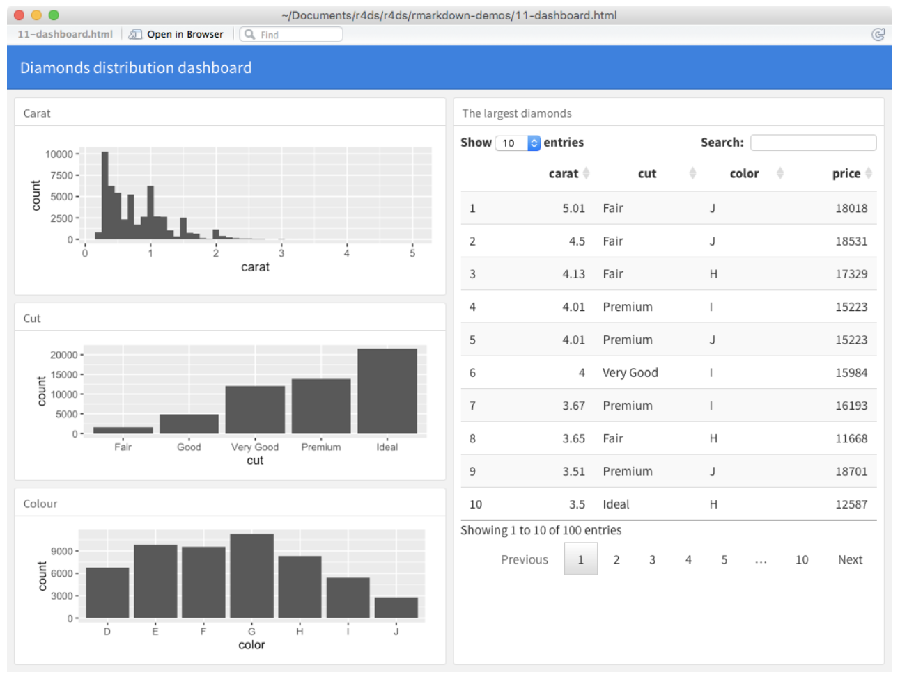
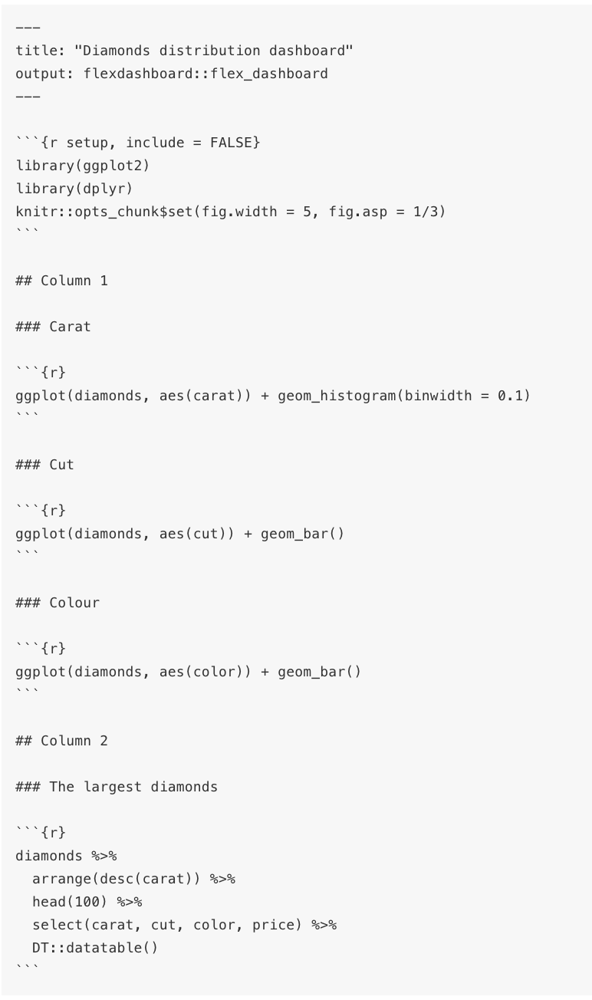

```{r setup, include=FALSE}
knitr::opts_chunk$set(echo = TRUE)
```

In Module 5, we are learning more about using R Markdown to create data analysis reports.  Another way to use R Markdown to share you work is to create a dashboardusing Flexdashboard.  Some of the material from today's class is adapted from "R for Data Science" by Grolemund and Wickham, section 29.6 and 29.7.2.  You can find these sections [here]](https://r4ds.had.co.nz/r-markdown-formats.html#dashboards) and [here](https://r4ds.had.co.nz/r-markdown-formats.html#shiny). You can find lots of other R Markdown formats, like presentations and websites in Chapter 29 of this books as well!

Dashboards allow you to communicate large amounts of information visually and quickly with the added benefit of allowing the user to interact with the data directly in the dashboard. **Flexdashboard** is a method of creating dashboards using R Markdown.  

Here's an example of what a dashboard might look like:


You can find a more information about creating dashboards [here](https://rmarkdown.rstudio.com/flexdashboard/).  We will look at a couple of example dashboards together, but refer to this link if you want more information on creating your own!

# Getting started

First we need to install the `flexdashboard` package to be able to create these dashboards.  Remember you will only need to install this package once!
```{r eval=FALSE}
install.packages("flexdashboard")
```

To create a new dashboard, select **File** --> **New File** --> **R Markdown...**  Choose **From Template** in the box on the left and then select **Flex dashboard** from the box on the right.  This will open up a dashboard template.  You can knit this file just as you would a regular R Markdown document.  Let's do that and take a look at what you get!

# Layouts

Notice the layout of the blank document is given by the hash (#) signs.  In general:

* Each level 1 header (#) begins a *new page* in the dashboard.
* Each level 2 header (##) begins a *new column*.
* Each level 3 header (###) begins a *new row*.

For example, the code below produces the dashboard example at the beginning of this document.  


You can also find this code in the file `Diamond_dashboard_example.Rmd` in this project. To run the code, though, we need to install the `DT` package that provides a nice way to display data on an HTML website.  Install this package using the code below and then open and run the diamond dashboard file.
```{r eval=FALSE}
install.packages("DT")
```

# Shiny

Adding the `shiny` package when creating your flex dashboard allows you to let your users change underlying parameters and see the results immediately on the dashboard without needing to re-knit the document.  Basically, using Shiny with flex dashboard turns a static R Markdown report into an Interactive Document. It’s important to note that interactive documents need to be deployed to a Shiny Server to be shared broadly (see instructions for creating a free http://www.shinyapps.io/ and instructions on how to publish to the web at the end of this document.).

To work with `shiny`, you need to first install it:
```{r eval=FALSE}
install.packages("shiny")
```

Then you add the option `runtime: shiny` to the YAML header of your flex dashboard .Rmd file.  Once you've done this, you can use the “input” functions to add interactive components to the document:

```{r eval=FALSE}
textInput("name", "What is your name?")
numericInput("age", "How old are you?", NA, min = 0, max = 150)
selectInput("variable", "Variable:",
                  c("Cylinders (cyl)" = "cyl",
                    "Transmission (am)" = "am",
                    "Gears (gear)" = "gear"))
checkboxInput("outliers", "Show outliers", TRUE)
```

You can then refer to the values with input$name and input$age, and the code that uses them will be automatically re-run whenever they change.

To add Shiny componets to a flex dashboard you must do the following:

* Add `runtime: shiny` to the YAML header at the top of the document.
* Add the `{.sidebar}` attribute to the first column of the dashboard to make it a host for Shiny input controls (note this step isn’t strictly required, but many Shiny based dashboards will want to do this).
* Add Shiny inputs and outputs as appropriate.
* When including plots, be sure to wrap them in a call to `renderPlot`. This is important not only for dynamically responding to changes but also to ensure that they are automatically re-sized when their container changes.

# Shiny examples

There are a couple examples of simple flex dashboards that use Shiny in the following files:

* `GeyserFlexDashboard.Rmd`
* `MPGFlexDashboard.Rmd`

# Many other examples!

You can find lots and lots and lots of examples of more complicated flex dashboards (most of which use Shiny) [here](https://rmarkdown.rstudio.com/flexdashboard/examples.html)

# Practice

Starting with the `MPGFlexDashboard.Rmd` file, create a dashboard that allows users to explore the NMES dataset by seeing how total medical expenditures relate to other variables in the dataset.  We could also think about adding options to allow the user to specify log10 medical expenditures instead!

# Other Resources

Below are instructions for getting a free `Shinyapps.io` account and then publishing your flex dashboard to the web:

1. Sign up for a free account on [http://www.shinyapps.io/](http://www.shinyapps.io/)
2. Within RStudio, install the rsconnect package: install.packages("rsconnect")
3. Within RStudio, under the "Preferences" menu, click on "Publishing".  Click the "Connect" button next to the publishing accounts box to link your shinyapps.io account to your RStudio.  Click on "Shinyapps.io" from the pop-up menu, and then follow the instructions to link your account. This involves copying and pasting a token from your account into the box in R Studio.
4. Now you are ready to publish!  Click the "Run Document" button to create your app; then click "Publish" in the upper right hand corner of your app. Choose "Publish just this document" from the pop-up menu.  Make sure the selected destination account is your shinyapps.io account.  You can change the name of the app if you want.  Then click publish!
5. If you want to delete the app (unpublish it), you need to do this from within your shinyapp.io account.  Go to [http://www.shinyapps.io/](http://www.shinyapps.io/) and log in to your account.  Click on applications to manage your applications.  You must first archive your app before you can delete it.

Here are a list of resources on Shiny (more involved than Flex Dashboard):

* Main page: http://shiny.rstudio.com
* Awesome tutorial: http://shiny.rstudio.com/tutorial/
* Very cool illustrations of statistical concepts (especially useful for our class are Multiple Regression Visualization and Sampling Distributions of Various Statistics): http://statistics.calpoly.edu/shiny
* An example app that Ruthe (one of our former TAs) made in a class: https://gunben.shinyapps.io/Pneumonia426/


